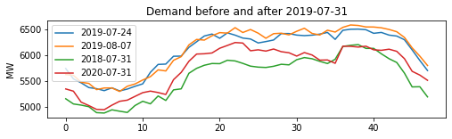

# Machine Learning Engineer Nanodegree
## Capstone Project
Javier Castillo Peña  
April 14th, 2023

# Forecasting hourly power demand with Amazon Sagemaker


## I. Definition


### Project Overview
In Peru, electricity bill for free users includes mainly charges for generation, transmission, distribution, and other regulated fees. Free users are large consumers (with a maximum annual demand over 200 kW) which contract directly with a power generator the price of their electricity, while the prices for 
transmission and distribution are established by the national regulator.  

Transmission charges may represent about 20% of the monthly electricity bill of a free user. This toll fee for using the transmission system is determined by a regulated price multiplied by the user's power demand (in kW), also known as “coincident peak demand”, at the time of the monthly national electric 
system's peak demand measured in 15-minute periods. This methodology by the national regulator aims to incentivize the reduction of consumption during peak hours from 5:00 pm to 11:00 pm.  

In order to optimize their energy bill, free users should improve their consumption behavior by reducing their “coincident peak demand”. Besides, other “peak shaving” strategies include using locally produced electricity or energy battery storage to reduce demand from the electricity grid. In any case, predicting national power demand can help to apply those strategies to reduce “coincident peak demand” and the respective transmission charges. 

Although national demand data is published by the independent system operator (COES), no open-source tool to predict national power demand is available in the market. The aim of this project is to build a machine learning model to forecast Peru’s power demand to help consumers to optimize their “coincident peak demand” and reduce their electricity bill.  


### Problem Statement
The problem to be solved in this project is to forecast hourly power’s demand of the Peruvian national electric system (SEIN) using time series historical data. By predicting power demand, a free user (large consumer) can make better decisions such as optimizing their “coincident peak demand” at the time of the monthly national electric system's peak demand from 5:00 pm to 11:00 pm and, therefore, reduce their transmission charges that can represent about 20% of their electricity bill. 

To solve the problem, a machine learning model is built to forecast one-day ahead hourly power demand using historical data, [Amazon Sagemaker](https://aws.amazon.com/sagemaker) platform and the [AutoGluon](https://auto.gluon.ai/stable/index.html) framework which performs advanced data processing, deep learning, and multi-layer model ensemble methods.

The project is developed following the next steps:  

1. Data extraction, transformation, and load.
2. Exploratory data analysis (EDA).
3. Building of a benchmark model.
4. Model training with raw data using AutoGluon.
5. Feature engineering.
6. Model training using AutoGluon with new features (time-varying covariates).
7. Benchmark of models


### Metrics
Based on the characteristics of the forecasting problem, the performance of the model is measured using the RMSE metric, also known as  [RMSD](https://en.wikipedia.org/wiki/Root-mean-square_deviation). The objective is to build a machine learning model with the lowest RMSE that helps free users to make decisions on reducing their “coincident peak demand” on peak hours from 5:00 pm to 11:00 pm.


<div align="center">
      
    <div>Fig. 1 RMSE Formula. Source: Wikipedia</div>
</div>
</br>


## II. Analysis


### Data Exploration
Power demand data of the national electric system (SEIN) is publicly available by the national system operator (COES) and includes the following:

1. "Demand": Power demand of the national electric system (SEIN) in MW registered in 15-minute periods and reported monthly. This data is collected from meters and used to determine the monthly peak demand. [Data extraction](./data/etl_peak_demand.ipynb)  
Source: [https://www.coes.org.pe/Portal/portalinformacion/demanda?indicador=maxima](https://www.coes.org.pe/Portal/portalinformacion/demanda?indicador=maxima)
2. "SEIN demand": Power demand of the national electric system (SEIN) in MW registered in 30-minute periods and reported daily the next day of operations. Data collected from SCADA systems. [Data extraction](./data/etl_sein_demand.ipynb)  
Source: [https://www.coes.org.pe/Portal/PostOperacion/Reportes/Ieod](https://www.coes.org.pe/Portal/PostOperacion/Reportes/Ieod)
3. "Total demand": Total power dispatch data published in 30-minute periods. This data collected from SCADA systems includes power dispatch from COES and non-COES generators. [Data extraction](./data/etl_total_demand.ipynb)  
Source: [https://www.coes.org.pe/Portal/portalinformacion/demanda](https://www.coes.org.pe/Portal/portalinformacion/demanda)  

[Figure 2](#fig_2) shows the differences among "demand", "SEIN demand", and "total demand" in MW.


<div align="center">
      
    <div>Fig. 2 Comparison of demand data.</div>
</div>
</br>


Although monthly meter data ("demand") is used to determine peak demand, to forecast one-day ahead hourly demand, data collected from SCADA systems ("SEIN demand") was chosen because it is available daily. Despite a low deviation of 70.1592 MW (calculated in terms of RMSE) between meter and SCADA measurements , the selection of the monthly peak day can still be affected. As shown in [Figure 3](#fig_3), 60% of monthly peak days from January 2016 to February 2023 were the same when evaluated using “SEIN demand” data.

<div align="center">
    
    <div>Fig. 3 Monthly peak demand days from January 2016 to February 2023.</div>
</div>  
</br>


The original demand data is published in Excel reports for each day of operation; therefore, some scripts to download, extract, transform, and load the data into a single dataset were developed ([demand_data_merging.ipynb](./data/demand_data_merging.ipynb)). The merged dataset contains the following fields:  

- ```'datetime'```: Date and time in "yyyy-mm-dd hh:mm:ss" format and 30-minute periods.
- ```'demand'```: Power demand of the national electric system (SEIN) in MW collected from meters. Data from January 2003 to February 2023.
- ```'sein_demand'```: Power demand of the national electric system (SEIN) in MW collected from SCADA systems. Data from January 2016 to February 2023.  


### Exploratory Visualization
The power demand of the national electric system was analyzed as it is shown in the following figures. First, [Figure 4](#fig_4) shows the distribution of power demand, while in [Figure 5](#fig_5) and [Figure 6](#fig_6), it can be observed that power demand has been increasing since 2003, however, it was drastically reduced during COVID lockdown in 2020.

<div align="center">
    
    <div>Fig. 4 Histogram of power demand in MW.</div>
</div>  
</br>

<div align="center">
    
    <div>Fig. 5 Power demand from January 2003 to February 2023 in MW.</div>
</div>
</br>

<div align="center">
    
    <div>Fig. 6 Power demand by year from January 2003 to February 2023 in MW.</div>    
</div>
</br>


[Figure 7](#fig_7) shows the behavior of power demand during the year, where higher demand is required during spring and summer periods from September to March. Besides, as it was expected, demand decreases on weekend days (Saturdays and Sundays), as shown in [Figure 8](#fig_8).

<div align="center">
    
    <div>Fig. 7 Power demand by month in MW.</div>    
</div>
</br>

<div align="center">
    
    <div>Fig. 8 Power demand by day of the week in MW.</div>    
</div>
</br>


When exploring data during a day [Figure 9](#fig_9), it can be observed how the demand changes during the day and increases on peak hours. 

<div align="center">
    <div>
        
    </div>
    <div>Fig. 9 Power demand by hour in MW.</div>    
</div>
</br>


The behavior of power demand on peak hours was also analyzed, in order to observe historical data patterns. [Figure 10](#fig_10) shows that peak demand occurs more frequently in the last week of the month, on Wednesday, and at 19:00 hours. However, peak demand has also occasionally occurred on Saturday, before 18:00 hours or after 21:00 hours.

<div align="center">
    <div>
        
    </div>
    <div>Fig. 10 Histograms of power demand during peak hours.</div>    
</div>
</br>


### Algorithms and Techniques
Accurately forecasting power demand can be a challenging task that requires a combination of machine learning skills and high-quality tools. This project leverages the features provided by AutoGluon, which is a machine learning library designed to develop high-performing models. 

AutoGluon TimeSeries is a module of AutoGluon that is specifically designed for time series forecasting tasks. AutoGluon TimeSeries automates the process of developing accurate and robust time series models. It provides a range of features, including automatic feature engineering, hyperparameter tuning, and ensembling, to optimize model performance. 

The algorithms available to fit with [AutoGluon](https://auto.gluon.ai/stable/tutorials/timeseries/forecasting-quick-start.html) include simple baselines (Naive, SeasonalNaive), statistical models (ARIMA, ETS, Theta), tree-based models XGBoost, LightGBM and CatBoost wrapped by AutoGluonTabular, a deep learning model DeepAR, and a weighted ensemble combining that combines predictions of these models.

The following steps describe the process to train a model with AutoGluon TimeSeries:

1. Data preparation.
2. Loading time series data as a ```TimeSeriesDataFrame```.
3. Training time series models with ```TimeSeriesPredictor.fit```.
4. Generating forecasts with ```TimeSeriesPredictor.predict```. 
5. Evaluating the performance of different models.   


### Benchmark

A simple naïve model is used as a benchmark model, where the most recent known value is used as the predicted value at the same time the next day. In this manner, the previous day power demand at a specific time is used as the predicted value for the next day demand at the same time. In order to compare the performance of the benchmark model and the machine learning models, a RMSE of 337.7162 MW was calculated on the same test dataset. The aim of this project is to surpass the results obtained by the naïve model. [Figure 11](#fig_11) and [Figure 12](#fig_12)  show predictions of the benchmark model for a one-month and 6-month periods, respectively.


<div align="center">
    
    <div>Fig. 11 Predictions of benchmark model for June 2022.</div>    
</div>
</br>

<div align="center">
    
    <div>Fig. 12 Predictions of benchmark model from June to December 2022.</div>    
</div>
</br>

## III. Methodology

### Data Preprocessing
As described above, the original time series data contains data of power demand registered in 30-minute periods. The preprocessing process included data cleaning and feature engineering. In order to enhance the machine learning model, feature engineering played a key role to increase power demand forecasting accuracy. 
 
Some missing values were detected for three days of power demand data ("SEIN demand") on 2019-07-31, 2020-11-04, and 2020-12-25. Two strategies were analyzed to replace missing data, either the mean between values from the previous and the next week or the mean between values from the previous and the next year. For instance, missing demand on 2019-07-31 and 2020-11-04 were replaced with the mean between values from the previous and the next week, as shown in [Figure 13](#fig_13) and [Figure 14](#fig_14).  

<div align="center">
    
    <div>Fig. 13 Demand data to replace missing values on 2019-07-31.</div>    
</div>
</br>

<div align="center">
    
    <div>Fig. 14 Demand data to replace missing values on 2020-11-04.</div>    
</div>
</br>

Besides, in the case of missing demand on 2020-12-25, it was replaced with the mean between demand values on the same date in 2019 and 2021, as shown in [Figure 15](#fig_15).

<div align="center">
    
    <div>Fig. 15 Demand data to replace missing values on 2020-12-25.</div>    
</div>
</br>


Feature engineering is the process of selecting and transforming raw data into features that can be used to improve machine learning models' accuracy and generalization. First, AutoGluon recognizes intrinsic features from date and time, sucha as year, month, day, and hour. Besides, the following features were incorporated into the training data:


1. ```'workday'``` Working day: Boolean feature that is True if date is a working day from Monday to Friday.  
2. ```'holiday'``` Holyday: Boolean feature that is True if date is a public holiday.  
3. ```'on_peak'``` Peak hours: Boolean feature that is True if power demand occurs during peak hours from Monday to Saturday, from 5:00 pm to 11:00 pm,  excluding holidays.
4. ```'season'``` Season: This feature classifies demand for 'summer', 'fall', 'winter', and 'spring'. These categories were transformed into dummy variables. 
5. ```'time_of_day'``` Time of the day: This feature classifies demand during 'night', 'morning', 'noon', and 'evening'. These categories were transformed into dummy variables.
6. ```'on_covid'``` COVID period: It was observed a significant decrease in power demand during COVID lockdown in 2020. Therefore, a boolean feature was introduced for the instances between March and September 2020. FIG XX shows the behavior of power demand during that period.


<div align="center">
    
    <div>Fig. 16 Power demand during COVID lockdown in 2020.</div>    
</div>
</br>

<div align="center">
    
    <div>Fig. 17 Comparison of power demand before and after COVID lockdown.</div>    
</div>
</br>


### Implementation
The implementation process to develop a machine learning model with AutoGluon TimeSeries followed 5 stages: data preparation, data loading, training, prediction, and evaluation. The stages are described as follows:

1. Data preparation.  
The dataframe was split to use 80% of data for training and 20% for testing. The train dataset contains data from 2020-01-01 to 2022-05-31, while the test data from 2022-06-01 to 2022-12-31.  

    As required by AutoGluon, each row of the data frame should contain a single observation (```'datetime'```) of a single time series represented by:  
      - unique ID of the time series (```'item_id'```) as int or str. A single value "D1" was set for the entire dataset.
      - timestamp of the observation (```'datetime'```) as a pandas.Timestamp or compatible format.
      - numeric value of the time series target (```'sein_demand'```)

    A first model was fit only with the following features:  
    
    ```python
    'item_id', 'datetime'
    ```

    On the other hand, a second model was trained using the following time-varying covariates, in addition to the previous features:
    
    ```python
    'workday', 'on_peak', 'holiday', 'on_covid', 'season_summer', 'season_fall','season_winter',
    'season_spring', 'time_of_day_night', 'time_of_day_morning', 'time_of_day_noon', 'time_of_day_evening'
    ```
  
2. Loading time series data as a ```TimeSeriesDataFrame```.  
    
    Autogluon Timeseries requires the class TimeSeriesDataFrame to store the time series dataset, as follows:

    ```python
    train_data = TimeSeriesDataFrame.from_data_frame(
        train_data,
        id_column="item_id",
        timestamp_column="datetime"
    )
    test_data = TimeSeriesDataFrame.from_data_frame(
        test_data,
        id_column="item_id",
        timestamp_column="datetime"
    )
    ```


3. Training time series models with ```TimeSeriesPredictor.fit()```.  

    AutogGluon requires a ```TimeSeriesPredictor``` object to be created to forecast future values of the time series. The target to forecast is stored in the column ```'sein_demand'``` of the ```TimeSeriesDataFrame```.
    
    The forecast horizon is set with the ```prediction_length``` parameter. In this project, the dataset contains time series measured at 30-minute periods, so the prediction_length was set to 48 to train models that forecast up to 24 hours into the future.
    
    Besides setting the path to save trained models, it was specified that AutoGluon should rank models according to the RMSE metric.
    
    ```python
    predictor = TimeSeriesPredictor(
        prediction_length=prediction_length,
        path="./AutogluonModels/ag-raw-1h-sein-demand",
        target="sein_demand",
        eval_metric="RMSE",
    )
    ```
    
    To fit the model, it was used the "medium_quality" presets and the training time was limited to 20 minutes (1200 seconds). The medium_quality presets define the models to fit such as simple baselines (Naive, SeasonalNaive), statistical models (ARIMA, ETS, Theta), tree-based models XGBoost, LightGBM and CatBoost wrapped by AutoGluonTabular, a deep learning model DeepAR, and a weighted ensemble combining these. By default, AutoGluon sets the validation set as the last ```prediction_length``` timesteps in ```train_data```.
    
    ```python
    predictor.fit(
        train_data,a
        presets="medium_quality",
        time_limit=1200,
    )
    ```

    
4. Generating forecasts with ```TimeSeriesPredictor.predict()```.

    Once the model was trained, the fitted ```TimeSeriesPredictor```can be used to forecast the future time series values. By default, AutoGluon makes forecasts using the model that had the best score. The forecast includes predictions for the next ```prediction_length``` timesteps, starting from the end of the time series in train_data. For instance, as ```train_ data``` includes demand from 2020-01-01 to 2022-05-31, AutoGluon will predict 48 timesteps i.e power demand on 2022-06-01 in 30-minute periods.  
    
    ```python
    predictions = predictor.predict(train_data)
    ```


5. Evaluating the performance of different models. 
    
    The machine learning models were used to make forecast on the test period from 2022-06-01 to 2022-12-31 (5136 predictions). Finally. the models were evaluated using the RMSE metric.
    
    

### Refinement
As mentioned in the Implementation section, in the first run, it was used only the ```'datetime'``` feature. In the second run, in order to improve the performance of the model, covariates (time-varying features) were introduced since they may influence the target (```'sein_demand'```). The ```TimeSeriesPredictor``` was updated as follows for the second run:

```python
known_covariates_names = ['workday', 'on_peak',
                          'holiday', 'on_covid', 'season_summer', 'season_fall',
                          'season_winter', 'season_spring', 'time_of_day_night',
                          'time_of_day_morning', 'time_of_day_noon', 'time_of_day_evening']


predictor = TimeSeriesPredictor(
    prediction_length=prediction_length,
    path="./AutogluonModels/ag-new-features-1h-sein-demand",
    target="sein_demand",
    eval_metric="RMSE",
    known_covariates_names=known_covariates_names,
)
```

## IV. Results


### Model Evaluation and Validation
The performance of the machine learning models was evaluated on validation and test data. The validation score for the first model was 89.923456 MW (RMSE), while the second model obtained a RMSE of 77.705239 MW. In both cases, it can be observed that the best model was an ensemble model ("WeightedEnsemble"). [Figure 18](#fig_18) and [Figure 19](#fig_19) show the validation scores for different models in the first and second run, respectively.

<div align="center">
    
    <div>Fig. 18 Validation scores for the trained models in the first run.</div>    
</div>
</br>

<div align="center">
    
    <div>Fig. 19 Validation scores for the trained models in the first run.</div>    
</div>
</br>


When testing both models, the results show that the first run model obtained a RMSE of 137.2041 MW, while the model with feature engineering in the second run returned a RMSE of 111.4882 MW. The next figure summarizes the obtained test scores:

<div align="center">
    
    <div>Fig. 20 Test score comparison for trained and benchmark models.</div>    
</div>
</br>

In addition, the following figures show a sample of demand predictions of both models for June 2022.


<div align="center">
    
    <div>Fig. 21 Model 1: one-day ahead hourly demand forecasts for the first week of June 2022.</div>    
</div>
</br>

<div align="center">
    
    <div>Fig. 22 Model 1: one-day ahead hourly demand forecasts for June 2022.</div>    
</div>
</br>

<div align="center">
    
    <div>Fig. 23 Model 2: one-day ahead hourly demand forecasts for the first week of June 2022.</div>    
</div>
</br>

<div align="center">
    
    <div>Fig. 24 Model 2: one-day ahead hourly demand forecasts for June 2022.</div>    
</div>
</br>

### Justification
According to the results, the second model had the best performance when tested on 6-month data from June to December 2022. The RMSE obtained with this model is acceptable since the median of power demand was over 6,500 MW in 2022. Therefore, this model solves the problem by forecasting hourly power’s demand of the Peruvian national electric system (SEIN) with significant accuracy.

The decision to choose the second model is justified based on its performance when tested on 6-month data from June to December 2022. The results indicate that the second model outperformed the other models and had the best performance on the test data. The evaluation metric used, RMSE, is a widely used measure to assess the accuracy of predictions, and the acceptable RMSE obtained by this model is a good indication of its predictive power. It is also essential to compare the RMSE value with the scale of the target variable. In this case, the median of power demand was over 6,500 MW in 2022, and the RMSE indicates that the model can make predictions that are close to the actual values of the power demand.
The second model's performance on the test data suggests that it can accurately forecast the hourly power demand of the national electric system with significant accuracy and solves the problem statement.


## V. Conclusion

### Predictions on peak hours

The machine learning model built with Sagemaker and AuoGluon TimeSeries can predict power demand on peak hours. [Figure 25](#fig_25) shows the predictions made by the model on peak hours.

<div align="center">
    
    <div>Fig. 25 One-day ahead hourly demand forecasts on peak hours.</div>    
</div>
</br>


### Reflection
In this section, you will summarize the entire end-to-end problem solution and discuss one or two particular aspects of the project you found interesting or difficult. You are expected to reflect on the project as a whole to show that you have a firm understanding of the entire process employed in your work. Questions to ask yourself when writing this section:
- _Have you thoroughly summarized the entire process you used for this project?_
- _Were there any interesting aspects of the project?_
- _Were there any difficult aspects of the project?_
- _Does the final model and solution fit your expectations for the problem, and should it be used in a general setting to solve these types of problems?_

### Improvement
In this section, you will need to provide discussion as to how one aspect of the implementation you designed could be improved. As an example, consider ways your implementation can be made more general, and what would need to be modified. You do not need to make this improvement, but the potential solutions resulting from these changes are considered and compared/contrasted to your current solution. Questions to ask yourself when writing this section:
- _Are there further improvements that could be made on the algorithms or techniques you used in this project?_
- _Were there algorithms or techniques you researched that you did not know how to implement, but would consider using if you knew how?_
- _If you used your final solution as the new benchmark, do you think an even better solution exists?_